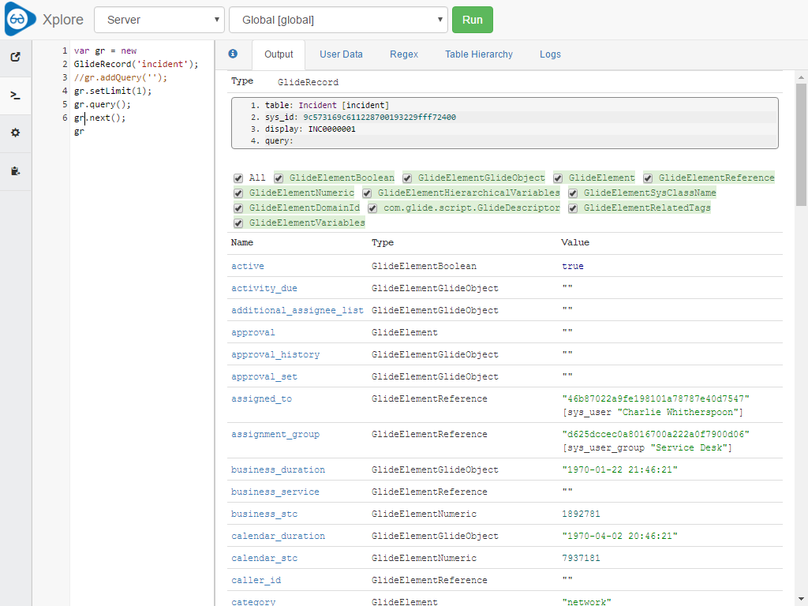
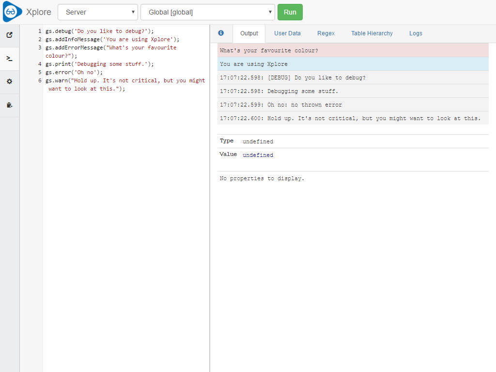
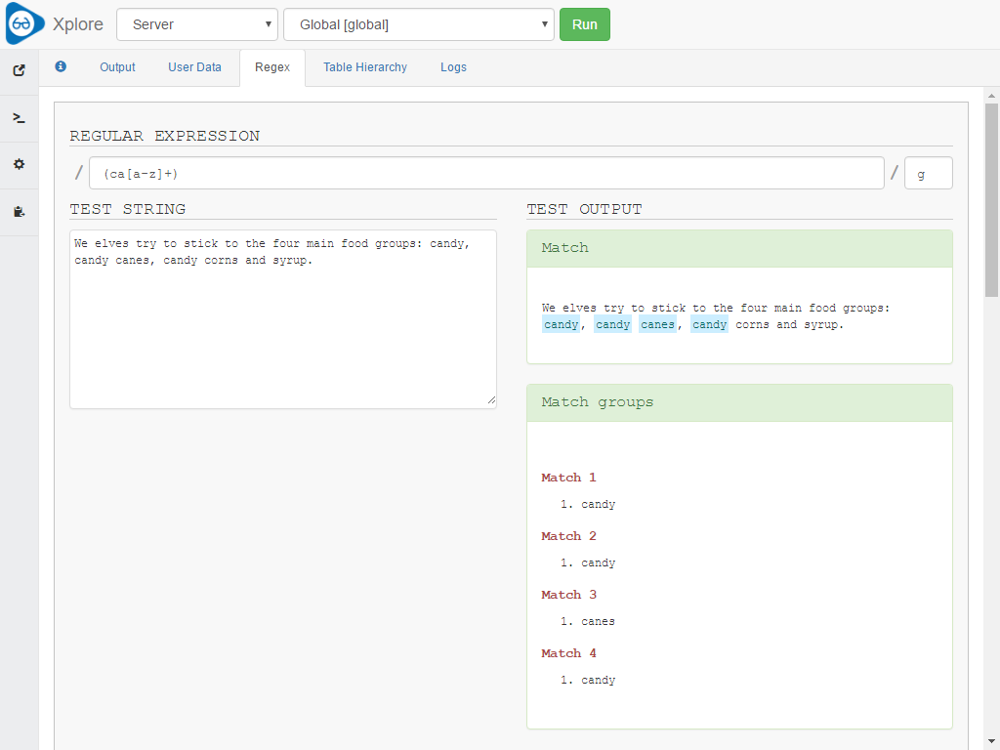
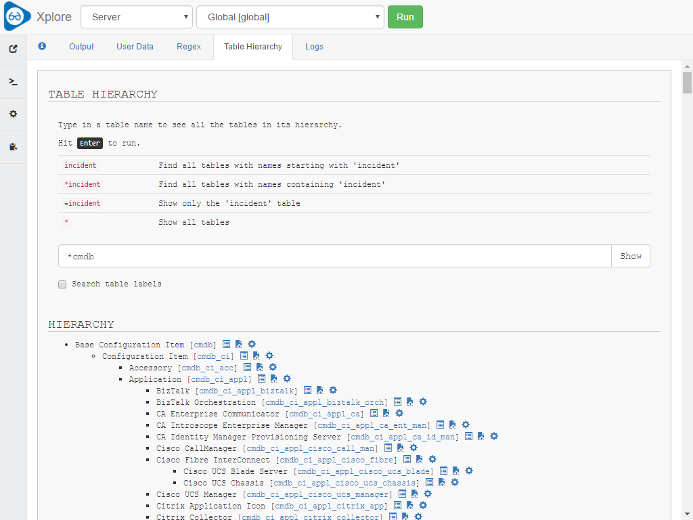
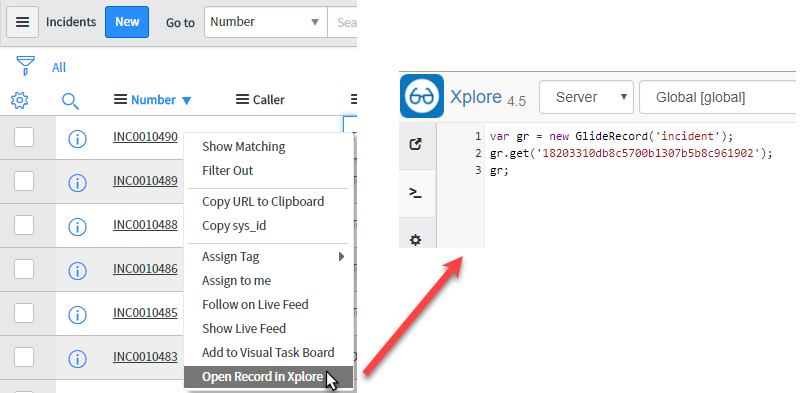
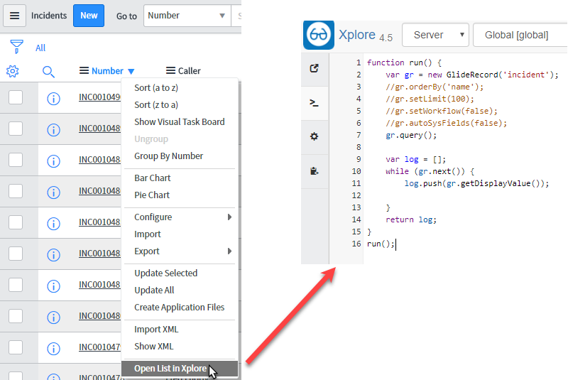

#  Xplore
A toolkit for every ServiceNow developer.

## Install Notes:
Download the update set from [Share](https://share.servicenow.com/app.do#/search-result?search_query=sndeveloper&startRow=NaN&sort_parameter=title) and install to your instance.

_Downloading from Share should mean you receive notifications when an update is made._

## About:
*Xplore* is designed to make solving everyday tasks in ServiceNow a breeze. Run
a quick script to find the value of something, or debug a complex script include.
Use one of the utilities to make development activities easier.

* Background script alternative - explore server side objects
* Client console alternative - explore client side objects
* Test and debug code and objects
* Built in regular expression testing tool
* Built in table explorer
* Built in log viewer
* Fuji, Geneva and Helsinki compatible

## The Interface

*Xplore* is designed primarily to run code and show you what the result of your code was.
Type your script into the script runner on the left, hit Run, and see the results
shown on the Output tab.

*Xplore* looks at the last object in the script.

## Logging

*Xplore* has some pretty clever features that make debugging really simple... like
capturing log messages and showing them to you.

Since Istanbul, we've been unable to retrieve the output logs including `gs.print`, `gs.log`, `gs.debug`, `gs.info`, `gs.warn`, and `gs.error`. In `v4.5` a workaround was added to replace calls to these functions so that the log messages could be captured. This workaround does not fix logs in your business rules or script includes. A new setting has been added to turn this functionality on and off from with in the Xplore UI. It is turned on by default.

## Regular Expressions

Everyone loves regular expressions. What do you mean, you don't?
Regardless, the utility built in *Xplore* will help you out and make it much easier
to do string matching and replacement without falling back on using substring methods.

## Table Hierarchy

Whether or not you've been working with ServiceNow for 6 months or 6 years, you
aren't going to know every single table in the database. This handy utility lets
you easily see what's going on, and find out whether or not ServiceNow have already
provided a table for that CI class you've been asked to add.

## Production Access

Version `4.5` added support for restricting script execution in Production. This is done by checking the `glide.installation.production` system property and if this is set `true` then also comparing a new system property called `snd_xplore.production_access`. This new property can be accessed using the Properties module in the Application. By default Production access is allowed as systems are "Production" by default.

## Context Menus

Two handy context menu items have been added to allow you to quickly open either a list or a record from any ServiceNow list. Simply right click on the list header or a list row and you'll be able to open Xplore and quickly start working with either the record set or individual record.

## Other Things

* **User Data** let's you work with large text strings in your script. It even allows you to automatically format JSON and XML.
* **Script Finder** allows you to quickly pull existing Script Includes into the
  editor so you can work with them.
* **Logs** has it's own tab. Forget about trying to navigate to the log table manually,
  you can do it right here. And it even supports node logs so you can jump into the logs for the script you just executed.

## Future
* **Intellisense** This is the most asked about feature since Helsinki was released.
  We're sure it's possible, we just need some more time on it. Feel free to chip in!

## License:

MIT, see [LICENSE.md](https://github.com/sn-developer/xplore/blob/master/LICENSE.md) for details.
