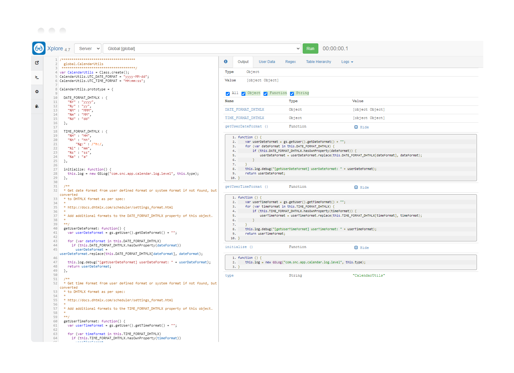

<section class="jumbotron text-center">
  

    <h1 class="jumbotron-heading">Xplore: Developer Toolkit</h1>
    
Exploratory programming and developer tools for ServiceNow

    

      <a class="btn btn-primary my-2" href="https://developer.servicenow.com/connect.do#!/share/contents/9650888_xplore_developer_toolkit" rel="noopener noreferrer" target="_blank">
        Download from Share
      </a>
     <a class="btn btn-secondary my-2" href="https://github.com/jneale/Xplore"
     rel="noopener noreferrer" target="_blank">
        View on Github
      </a>
    

  

</section>

<section>
  

    

      

        <h2 class="feature-headline">A must have for every developer</h2>
        

          
Xplore is used by ServiceNow developers across the world to improve development activities and support for their instances.

          
You can learn, test, write, and debug code, and so much more!

        

      

    

    

      
    

  

</section>

<section>
  

    

      

        

          
Exploratory Programming

          
Xplore was written to give quick and 
            clear insight into the structure of JavaScript and Java classes, 
            objects, properties, and variables.

        

      

      

        

          
Debugging

          
Write code, instantly execute it, debug,
            and repeat – all from the same interface.

        

      

      

        

          
Large Text Support

          
XWorking with large strings can be
            problematic. Xplore allows you to easily work with them for things
            like CSV parsing, XML processing and more.

        

      

      

        

          
Regular Expressions

          
Regular expressions can be difficult to
            get right. Xplore allows you to easily write and test your expressions
            with instant results.

        

      

      

        

          
Script Timer

          
Xplore has no limit on the transaction
            length, so you can execute time consuming scripts and see how long
            they’ve been running.

        

      

      

        

          
Transaction Cancellation

          
Xplore gives you safety from things like
            infinite loops by allowing you to cancel the transaction immediately.

        

      

      

        

          
Logs

          
Easily see what your script did using
            pre-filtered node logs in addition to standard system logs.

        

      

      

        

          
Scope Support

          
Don’t just run scripts in global, choose
            from any application scope in the system.

        

      

      

        

          
Visual Table Hierarchy

          
Easily search for tables and view the
            hierarchy on full or partial matches.

        

      

    

  

</section>