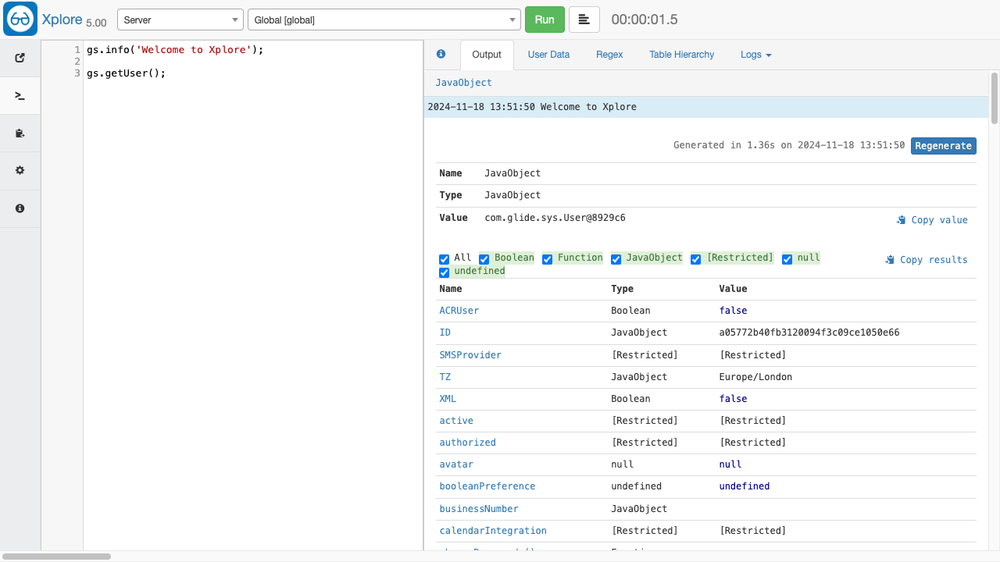

  <section class="jumbotron text-center">
    

      <h1 class="jumbotron-heading">Xplore: Developer Toolkit</h1>
      
Exploratory programming and developer tools for ServiceNow

      

        <a class="btn btn-primary my-2" href="https://developer.servicenow.com/connect.do#!/share/contents/9650888_xplore_developer_toolkit" rel="noopener noreferrer" target="_blank">
          Download from Share
        </a>
       <a class="btn btn-secondary my-2" href="https://github.com/jneale/Xplore"
       rel="noopener noreferrer" target="_blank">
          View on Github
        </a>
      

    

  </section>

  <section class="section-light">
    

      

        

          <h2 class="feature-headline">A must have for every developer</h2>
          

            
Xplore is used by professionals across the world to improve development activities and support for their instances.

            
As is a ServiceNow application built for developers by developers, you can learn, test, write, and debug code, and so much more!

          

        

      

      

        
      

    

  </section>

  <section>
    

      

        

          
Exploratory Programming

          
Xplore was written to give quick and clear insight into the structure of JavaScript and Java classes, objects, properties, and variables.

        

      

      

        

          
Exploratory Programming

          
Xplore was written to give quick and clear insight into the structure of JavaScript and Java classes, objects, properties, and variables.

        

      

      

        

          
Exploratory Programming

          
Xplore was written to give quick and clear insight into the structure of JavaScript and Java classes, objects, properties, and variables.

        

      

      

        

          
Exploratory Programming

          
Xplore was written to give quick and clear insight into the structure of JavaScript and Java classes, objects, properties, and variables.

        

      

      

        

          
Exploratory Programming

          
Xplore was written to give quick and clear insight into the structure of JavaScript and Java classes, objects, properties, and variables.

        

      

    

  </section>

